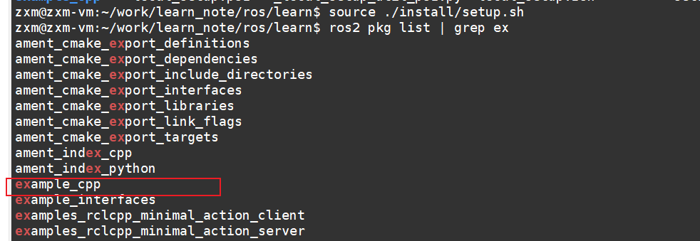
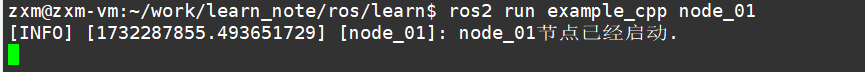

# ros2
## 安装
https://fishros.com/d2lros2foxy/#/chapt2/2.3ROS2%E7%9A%84%E5%AE%89%E8%A3%85
## 概念
1. 工作空间 ： 一个含有src文件夹的目录
2. 功能包 ： 存放节点的地方，分为3中类型
- ament_python
- cmake
- ament_cmake  cmake的增强版
3. 节点
## 构建
ros2中构建工具主要有colcon和ament_python,ament_cmake。三者的区别在于：
- ament_python：python编写， ament_python包中存放的是python文件， ament_python包中可以包含其他 ament_python包。
- ament_cmake：cmake编写， ament_cmake包中存放的是cmake文件， ament_cmake包中可以包含其他 ament_cmake包。
- colcon： ament_python和ament_cmake的集合体，可以同时构建ament_python和ament_cmake。
### 关系
1. 协作：colcon 负责管理和协调多个软件包的构建过程，而 ament_cmake 则负责每个软件包内部的构建细节。
2. 集成：colcon 可以调用 ament_cmake 来构建使用CMake的ROS 2包。当您运行 colcon build 时，colcon 会遍历所有需要构建的包，并调用 ament_cmake 来处理每个包的构建逻辑。
3. 灵活性：colcon 支持多种构建工具，ament_cmake 是其中的一种。这意味着您可以在同一个项目中使用不同的构建工具，例如 ament_python 用于Python包，而 ament_cmake 用于C++包。
## 创建功能包和节点
```sh
#1. 创建工作空间,可以简单理解为一个目录
mkdir -p ~/ros2_ws
#2. 创建功能包，功能包放置在工作空间的src目录下，在src目录下执行以下命令，会创建cmake，src,include等文件夹
ros2 pkg create example_cpp --build-type ament_cmake --dependencies rclcpp
#3. 创建节点， 节点即c++概念中可执行文件，一般使用cmake组织文件
add_executable(node_01 src/node1.cpp)
ament_target_dependencies(node_01 rclcpp)
# 安装到工作空间的目录下
install(TARGETS
  node_01
  DESTINATION lib/${PROJECT_NAME}
)
#4. 编译运行 在工作空间下
colcon build

```
效果如下


## 常用命令行
```sh
# 运行功能包下的节点
ros2 run <package_name> <executable_name>
# 查看功能包
ros2 pkg list
# 查看节点 （运行中的）
ros2 node list
# 查看节点详情
ros2 node info <node_name>
# 包相关命令
ros pkg create  <pkg name>      Create a new ROS2 package
ros pkg executables <pkg name>   Output a list of package specific executables
ros pkg list <pkg name>         Output a list of available packages
ros pkg prefix <pkg name>       Output the prefix path of a package
ros pkg xml <pkg name>          Output the XML of the package manifest or a specific tag
```

## 自定义消息
### 创建（以topic消息为例，其他类似）
1. 接口功能包，可单独创建
```sh
# 创建接口包
ros2 pkg create example_ros2_interfaces --build-type ament_cmake --dependencies rosidl_default_generators
```
2. 创建接口文件
```msg
uint32 status_move
uint32 status_stop
uint32  status
float32 pose
```
3. 修改cmake文件
```cmake
# 添加下面的内容
rosidl_generate_interfaces(${PROJECT_NAME}
  "msg/SelfTestMsg.msg"
)
```
4. 修改配置文件,不然编译会报错
```xml
  <depend>rosidl_default_generators</depend>
  <member_of_group>rosidl_interface_packages</member_of_group>
```
### 使用
1. cmake中增加依赖
```cmake
# 自定义消息
find_package(example_ros2_interfaces REQUIRED)
ament_target_dependencies(node_01 rclcpp std_msgs example_ros2_interfaces)
add_executable(node_02 src/node2.cpp)
ament_target_dependencies(node_02 rclcpp std_msgs example_ros2_interfaces)
```
2. 代码中使用
```cpp
#include "example_ros2_interfaces/msg/self_test_msg.hpp"
   auto publish2 = node->create_publisher<example_ros2_interfaces::msg::SelfTestMsg>("topic_02", 10);
   auto timer2 = node->create_wall_timer(std::chrono::milliseconds(1000),
                                       [&publish2, &count2,&node]() {
                                         example_ros2_interfaces::msg::SelfTestMsg m;
                                         m.status = count2++;
                                         m.status_stop = 0;
                                         publish2->publish(m);
                                       }
   );

```